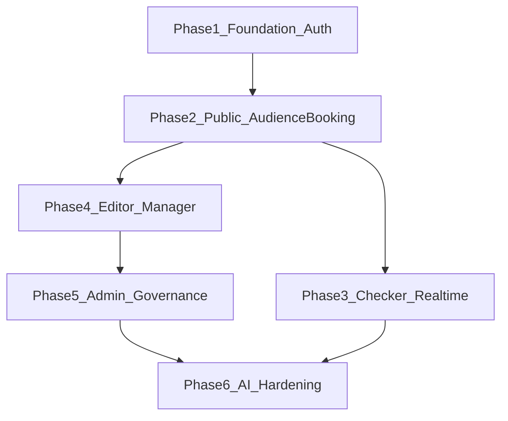

# Kế hoạch triển khai frontend GoTicket theo phase

## Mục tiêu triển khai
- Xây frontend React cho đầy đủ 5 nhóm vai trò (`admin`, `manager`, `editor`, `audience`, `checker`) theo đặc tả trong [d:\Project\GoTicket\GoTicket.md](d:\Project\GoTicket\GoTicket.md).
- Ưu tiên luồng business quan trọng nhất trước: auth/onboarding -> browse match -> chọn ghế -> checkout Stripe -> quản lý vé -> check-in realtime.
- Áp dụng DRY/Clean Code từ [d:\Project\GoTicket\CLEANCODE.md](d:\Project\GoTicket\CLEANCODE.md): constants tập trung, service layer, hook tái sử dụng, tránh magic numbers và duplicate API calls.

## Kiến trúc frontend áp dụng xuyên suốt
- **Routing + Guard:** `react-router-dom` + `ProtectedRoute` theo role; tách route public và private.
- **State:** Zustand stores theo domain (`authStore`, `seatStore`, `notificationStore`, `chatStore`), không để business state rải trong page.
- **API layer:** mọi request đi qua `services/api.js` và các domain service (`matchService`, `ticketService`...), không gọi `axios` trực tiếp trong component.
- **Constants-first:** tạo `src/constants/roles.js`, `src/constants/seatColors.js`, `src/constants/standRatios.js`, `src/constants/matchRules.js`, `src/constants/ticketRules.js`.
- **Shared utils/hooks:** `useCountdown`, `useSocket`, `useRecommendations`, `hotBadge`, `seatValidation`, `standGenerator`, `standValidation`.

## Phase 1 — Nền tảng ứng dụng (Foundation)
**Mục tiêu:** có skeleton frontend chạy ổn định, sẵn sàng mở rộng feature.

**Phạm vi chính**
- Bootstrap cấu trúc thư mục theo spec frontend trong [d:\Project\GoTicket\GoTicket.md](d:\Project\GoTicket\GoTicket.md).
- Thiết lập:
  - Router layout (`Navbar`, `Footer`, `ProtectedRoute`),
  - Axios instance + JWT interceptor,
  - Zustand auth store + refresh session,
  - Toast + error boundary cơ bản,
  - Base UI tokens (màu ghế, role constants, rule constants).
- Chuẩn hóa helper: `formatDate`, `formatCurrency`, `hotBadge`, `seatValidation`.

**Deliverables**
- App boot được đầy đủ route shell.
- Đăng nhập/đăng ký/onboarding hoạt động với API `auth`.
- Codebase tuân thủ naming + DRY checklist.

**Definition of Done**
- Không có axios call trực tiếp trong page/component.
- Không hardcode role/status/magic number trong UI logic.

## Phase 2 — Public experience + Audience booking flow (core revenue)
**Mục tiêu:** hoàn thiện hành trình đặt vé end-to-end cho audience.

**Phạm vi chính**
- Public pages: `HomePage`, `SportPage`, `MatchDetailPage`, `NewsListPage`, `NewsDetailPage`.
- Components: `MatchCard`, `NewsCard`, `SportsBanner`, `CountdownTimer`, `SeatMap`, `SeatLegend`.
- Audience pages:
  - `SeatSelectPage`: chọn ghế, validate tối đa 6 ghế và không để trống giữa.
  - `CheckoutPage`: Stripe Elements + summary booking.
  - `PaymentSuccessPage`: redirect + recommendation modal.
  - `MyTicketsPage`: list vé + QR inline + filter status.
- Realtime ghế: join room `match:{matchId}`, đồng bộ `seat:booked`.

**Deliverables**
- Flow `sport -> match -> seat select -> checkout -> success -> my tickets` chạy thông suốt.
- Countdown mở bán và hot badge hoạt động nhất quán.

**Definition of Done**
- Seat validation chạy cả trước submit và trước payment intent.
- UI phản ánh đúng trạng thái ghế realtime khi nhiều client cùng xem.

## Phase 3 — Checker + Realtime check-in operations
**Mục tiêu:** hỗ trợ soát vé tại cổng và theo dõi check-in realtime.

**Phạm vi chính**
- `QRScanPage` với `html5-qrcode`, gửi `POST /api/checkin/scan`.
- `CheckerDashboard` hiển thị thống kê realtime (`checkin:stats`).
- `LiveSeatMapPage` + `SeatMapLive` nhận event `seat:checked_in` và pulse animation.

**Deliverables**
- Luồng scan QR -> cập nhật trạng thái -> đồng bộ dashboard + live seat map realtime.

**Definition of Done**
- Xử lý đầy đủ case QR sai chữ ký/đã check-in/hủy vé với thông báo rõ ràng.

## Phase 4 — Editorial + Manager workflows
**Mục tiêu:** triển khai nhóm tính năng tạo nội dung và vận hành trận đấu.

**Phạm vi chính**
- Editor:
  - `EditorDashboard`, `NewsCreatePage`, `NewsEditPage`, `EditorNotificationsPage`.
  - TipTap editor, upload ảnh Cloudinary, submit duyệt.
- Manager:
  - `ManagerDashboard`, `MatchCreatePage`, `MatchEditPage`, `StandConfigPage`, `ManagerNotificationsPage`, `MatchAnalyticsPage`.
  - `StandConfigPage` dùng `generateStandsPreview` từ constants `STAND_RATIOS`, không copy thuật toán.
  - Revenue/analytics theo API manager scope.

**Deliverables**
- Editor/Manager có thể tạo nội dung-trận đấu và submit approval.
- Preview cấu hình khán đài tự động đúng quy tắc 30/30/20/20.

**Definition of Done**
- Không có duplicate logic giữa create/edit pages (trích hook/form shared).
- Notification rejection reason hiển thị đúng theo role.

## Phase 5 — Admin governance + platform controls
**Mục tiêu:** hoàn thiện lớp quản trị toàn hệ thống.

**Phạm vi chính**
- `AdminDashboard`, `ApprovalsPage`, `UserManagePage`, `SportsManagePage`, `LeagueManagePage`, `RevenueReportPage`.
- Notification bell realtime cho approval pipeline.
- Điều phối duyệt/từ chối `match`, `news`, `user_account` với feedback lý do.

**Deliverables**
- Admin vận hành đầy đủ vòng duyệt và quản trị master data.

**Definition of Done**
- Approval actions phản ánh đúng realtime và đồng bộ state toàn app.

## Phase 6 — AI assistant + hardening + production readiness
**Mục tiêu:** hoàn thiện UX nâng cao và ổn định trước release.

**Phạm vi chính**
- AI features: `AIChatModal`, `AIChatBubble`, intent dẫn user tới checkout query params.
- Debounce input chat 2s + cache recommendation 5 phút trong `chatStore`/`useRecommendations`.
- Cross-cutting:
  - loading/empty/error states chuẩn hóa,
  - route-level suspense,
  - optimistic update chọn ghế,
  - accessibility cơ bản,
  - smoke test critical flows.

**Deliverables**
- Trải nghiệm AI hoạt động nhưng không gây spam API.
- Ứng dụng ổn định để UAT/demo.

**Definition of Done**
- Critical flows pass: Auth, Booking, Payment success, Check-in, Approval.

## Thứ tự thực hiện đề xuất (ưu tiên theo giá trị)
- 1) Phase 1 -> 2) Phase 2 -> 3) Phase 3 -> 4) Phase 4 -> 5) Phase 5 -> 6) Phase 6.
- Sau mỗi phase: chốt checklist DRY từ [d:\Project\GoTicket\CLEANCODE.md](d:\Project\GoTicket\CLEANCODE.md), tránh dồn technical debt cuối dự án.

## Mermaid luồng tổng thể frontend
